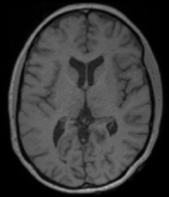
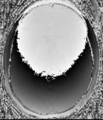
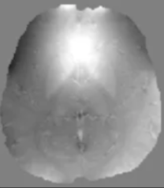
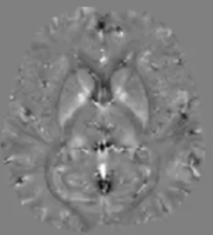
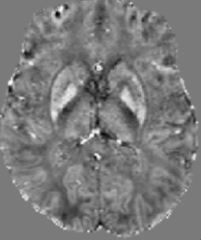

# Quantitative Susceptibility Mapping (QSM) Acquisition and Processing Pipeline

This repository provides a comprehensive pipeline for Quantitative Susceptibility Mapping (QSM) using Gradient Echo (GRE) MRI data. The code is designed to take users from raw multi-echo GRE data through key QSM processing steps, ultimately generating high-quality susceptibility maps suitable for neuroimaging research and analysis.

## Overview
Quantitative Susceptibility Mapping (QSM) is an advanced MRI technique that estimates the magnetic susceptibility of tissues, offering insights into iron content, myelination, and other microstructural properties of the brain and other organs. This repository implements a robust, step-by-step QSM workflow, including preprocessing, background field removal, and susceptibility inversion, with clear outputs at each stage for visualization and quality control

## Pipeline Steps
1. GRE Data Preparation
   Input: Multi-echo GRE magnitude and phase images (NIfTI format)
   Outputs: Organized data folders for each subject and session

   

  
  
   

  
3. Phase Unwrapping
  Purpose: Remove 2*pi phase jumps to ensure phase continuity across the brain
  Methods: Utilizes Rapid Opensource Minimum Spanning TreE AlgOrithm (ROMEO)
  Output: Unwrapped phase images for each echo.

   

  
   

5. Background Field Removal
   Purpose: Eliminate background magnetic field contributions from air-tissue interfaces and large-scale inhomogeneities.
   Methods: Implements V-SHARP.
   Output: Local field maps, which should be visually checked for residual background artifacts.
   
   
   
   
7. Susceptibility Inversion (QSM Reconstruction)
   Purpose: Convert local field maps into quantitative susceptibility maps
   Methods: Implementation of TKD inversion algorithm
   Output: Final QSM images, which can be visualized as susceptibility maps in NIfTI format.
   
